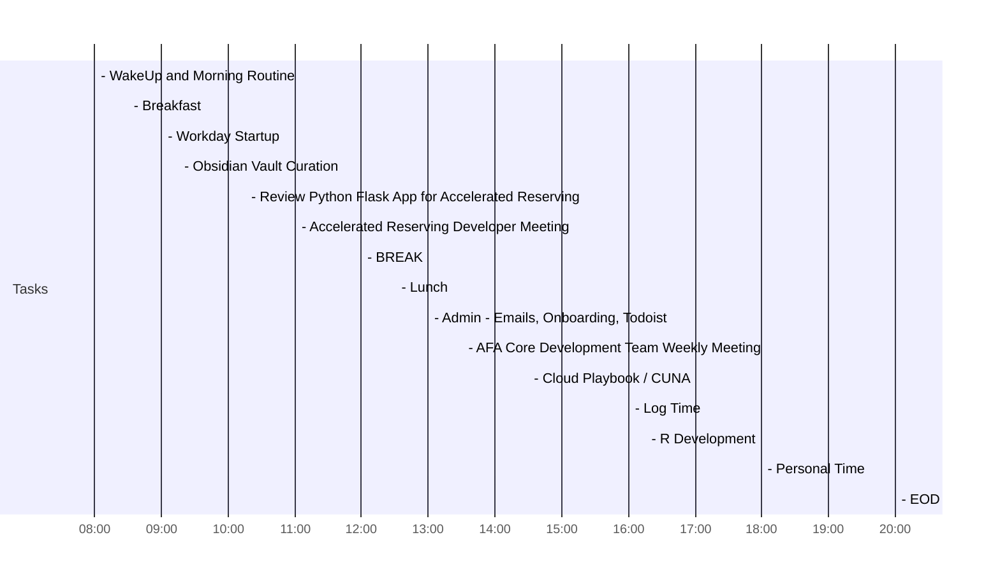

Type: #Type/Temporal/Daily

<< [[2021-10-26]] | [[2021-10-28]] >>

# October 27, 2021 - Wednesday

## Day Planner

- [x] 08:00 - WakeUp and Morning Routine
- [x] 08:30 - Breakfast
- [x] 09:00 - Workday Startup
- [x] 09:15 - Obsidian Vault Curation
- [x] 10:15 - Review Python Flask App for Accelerated Reserving
- [x] 11:00 - Accelerated Reserving Developer Meeting
- [x] 12:00 - BREAK
- [x] 12:30 - Lunch
- [x] 13:00 - Admin - Emails, Onboarding, Todoist
- [x] 13:30 - AFA Core Development Team Weekly Meeting
- [x] 14:30 - Cloud Playbook / CUNA
- [x] 16:00 - Log Time
- [ ] 16:15 - R Development
- [ ] 18:00 - Personal Time
- [ ] 20:00 - EOD

## Tasks

- [ ] Reach out to: [[Peichung Shih]]
- [ ] Respond to [[Steve Walsh]]'s email about claims data

### Todoist

<iframe src="https://todoist.com/app/upcoming#" allow="fullscreen" style="position: absolute; top: 0px; left: 0px; height: 100%; width: 100%;"></iframe>

***

Links:

Sources: